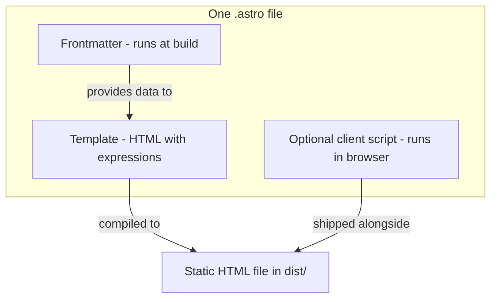

# What is Astro?

This chapter explains **Astro** — the framework this website is built with — and how this project uses it. Read [Concepts Glossary](02-concepts-glossary.md) first if any terms are unfamiliar.

---

## What Astro is

**Astro** is a web framework for building fast, content-focused websites. It takes source files (mostly `.astro` files) and compiles them into **plain HTML**, plus optional small JavaScript bundles for interactivity.

### How this site compares to WordPress

| | WordPress (typical) | This site (Astro) |
|---|---------------------|-------------------|
| When pages are built | On each visit (server + database) | Once at deploy (`npm run build`) |
| What visitors receive | HTML generated dynamically | Pre-built HTML files |
| Server in production | PHP/MySQL always running | None — static files only |
| Content editing | WordPress admin | Sanity Studio (separate app) |

This bakery site is **static**: fast, simple to host, and secure because there is no server code running when someone views a page.

---

## Static Site Generation (SSG)

This project uses Astro's default mode: **Static Site Generation**. When you run `npm run build`:

1. Astro reads every file in `src/pages/`
2. Frontmatter runs (including `await getSite()` to fetch Sanity content)
3. Templates compile to HTML with data baked in
4. Output is written to `dist/` as `.html`, CSS, and assets

Netlify serves those files. No Node.js process runs in production.

---

## The `.astro` file format

Every Astro page or component is a single `.astro` file with up to **three parts**:



### 1. Frontmatter (top `---` block)

JavaScript or TypeScript that runs **on the build machine** — your laptop during `npm run dev`, or Netlify during deploy. It does **not** run in the visitor's browser.

From [`src/pages/index.astro`](../src/pages/index.astro):

```astro
---
import BaseLayout from "../layouts/BaseLayout.astro";
import { getSite } from "../lib/getSite";

const site = await getSite();
const featuredReviews = site.reviews.slice(0, 2);
---
```

- **Imports** pull in layouts, components, and data functions
- **`await getSite()`** fetches Sanity content at build time (see [Sanity to HTML](03-sanity-to-html.md))
- Variables like `site` and `featuredReviews` are available in the template below

### 2. Template (HTML-like markup)

Describes page structure. Uses `{curly braces}` to inject frontmatter values into HTML.

From the same homepage:

```astro
<p class="tagline tagline-lg mb-3">{site.tagline}</p>
<p class="mx-auto mb-8 max-w-md">{site.description}</p>

```

At build time, Astro replaces `{site.tagline}` with the actual string (e.g. `For people with good taste`) and writes literal HTML:

```html
<p class="tagline tagline-lg mb-3">For people with good taste</p>
```

The visitor's browser sees finished text — no JavaScript needed to display it.

### 3. Client `<script>` (optional)

Vanilla JavaScript sent to the browser for interactivity. Only a few components use this: mobile menu ([`Navbar.astro`](../src/components/Navbar.astro)), order form submit ([`OrderForm.astro`](../src/components/OrderForm.astro)).

This project does **not** use React or Vue "islands." Astro supports hydrating interactive frameworks, but this site uses mostly static HTML plus small scripts.

---

## File-based routing

Files in `src/pages/` automatically become URLs:

| File | URL |
|------|-----|
| `src/pages/index.astro` | `/` (homepage) |
| `src/pages/order.astro` | `/order` |
| `src/pages/about.astro` | `/about` |
| `src/pages/contact.astro` | `/contact` |
| `src/pages/reviews.astro` | `/reviews` |

No router configuration file exists. Add a new page by adding a new `.astro` file.

There are **no API routes** — no `src/pages/api/` folder. The order form posts directly to Formspree from the browser.

---

## Layouts

[`src/layouts/BaseLayout.astro`](../src/layouts/BaseLayout.astro) wraps every page. Pages use it like this:

```astro
<BaseLayout title="Home" description={descriptions.home}>
  <!-- page-specific content here -->
</BaseLayout>
```

Inside the layout, `<slot />` is where each page's content is inserted. The layout also provides shared `<head>` meta tags, `Navbar`, and `Footer`.

---

## Components

Reusable `.astro` files live in `src/components/`. Import and use them like HTML tags:

```astro
import ReviewCard from "../components/ReviewCard.astro";

<ReviewCard quote={review.quote} author={review.author} />
```

### Props and `Astro.props`

Child components declare what data they accept:

```astro
---
interface Props {
  site: SiteConfig;
  products: Product[];
}
const { site, products } = Astro.props;
---
```

The parent passes props as attributes: `<OrderForm site={site} products={products} />`.

---

## Dev vs production

| Command | What happens |
|---------|--------------|
| `npm run dev` | Dev server at `localhost:4321`. Frontmatter re-runs when you load a page — Sanity fetch feels "live" locally. |
| `npm run build` | Produces `dist/` with static HTML. Sanity is fetched once per build. |
| `npm run preview` | Serves the built `dist/` locally to test production output. |

**Important:** In production, CMS edits do not appear until Netlify rebuilds the site. Local dev can mislead you into thinking changes are instant everywhere. See [Sanity to HTML — Timing](03-sanity-to-html.md#timing-build-time-vs-live-site).

---

## Build output

`npm run build` creates the `dist/` folder:

```
dist/
  index.html          ← homepage
  order/index.html    ← /order
  about/index.html
  ...
  _astro/             ← bundled CSS/JS
```

Netlify serves `dist/` as static files. No Astro or Node.js runs when a customer visits the site.

---

## How Astro connects to Sanity (preview)

Astro does not include a CMS. This project connects Sanity manually:

1. Frontmatter calls `getSite()` / `getProducts()`
2. Those functions fetch Sanity via GROQ at build time
3. Template uses `{site.tagline}` etc. to embed content in HTML

The full pipeline is documented in [Sanity to HTML](03-sanity-to-html.md).

---

## See also

- [Sanity to HTML pipeline](03-sanity-to-html.md)
- [Architecture overview](04-architecture.md)
- [Home page walkthrough](07-pages/home.md) — concrete Astro + Sanity example
