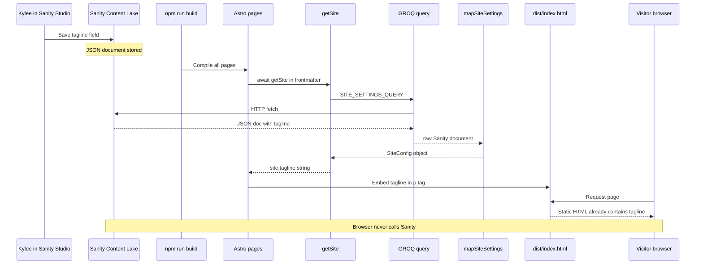

# Sanity CMS to HTML Pipeline

This is the central explanation of how **Sanity CMS content becomes visible HTML** on the live website. Sanity and Astro are two separate applications that share content through an API.

---

## Three separate pieces

| Piece | Location | Role |
|-------|----------|------|
| **Sanity Studio** | `sanity/` folder, hosted at [love-ky-cakes.sanity.studio](https://love-ky-cakes.sanity.studio/) | Where Kylee edits text, images, products |
| **Sanity Content Lake** | Sanity's cloud (project `1bzd5noi`, dataset `production`) | Stores content as JSON documents |
| **Astro site** | `src/` folder, built to `dist/` | Fetches documents at build time, renders HTML |

The live website a visitor sees is **plain HTML** with Sanity values already embedded. The browser does **not** call Sanity when loading a normal page.

---

## The 7-step pipeline

Trace one piece of content — the homepage **tagline** — through every layer:

| Step | Where | What happens |
|------|-------|--------------|
| 1. Edit | Sanity Studio → Site Settings → Tagline | Kylee types text; saved to Sanity cloud |
| 2. Schema | [`sanity/schemaTypes/siteSettings.ts`](../sanity/schemaTypes/siteSettings.ts) | Defines the field exists and its type (`string`) |
| 3. Query | [`src/lib/sanity/queries.ts`](../src/lib/sanity/queries.ts) `SITE_SETTINGS_QUERY` | GROQ fetches `tagline` from document `_id == "siteSettings"` |
| 4. Fetch | [`src/lib/getSite.ts`](../src/lib/getSite.ts) → [`client.ts`](../src/lib/sanity/client.ts) | `@sanity/client` calls Sanity API during `astro build` |
| 5. Map | [`src/lib/sanity/mapSiteSettings.ts`](../src/lib/sanity/mapSiteSettings.ts) | Converts Sanity JSON → `SiteConfig`; uses [`shared/defaultSite.ts`](../shared/defaultSite.ts) if field is empty |
| 6. Use in Astro | [`src/pages/index.astro`](../src/pages/index.astro) frontmatter: `const site = await getSite()` | `site.tagline` is a JavaScript string in frontmatter |
| 7. Render to HTML | Template: `<p class="tagline">{site.tagline}</p>` | Astro writes literal text into `dist/index.html` |



---

## Trace: text field (tagline)

**Step 1 — Edit:** In Studio, Site Settings → Tagline → `"For people with good taste"` → Publish.

**Step 2 — Schema:** The `tagline` field is defined as a `string` in the site settings schema.

**Step 3 — Query:** GROQ selects the field:

```groq
*[_type == "siteSettings" && _id == "siteSettings"][0]{
  tagline,
  ...
}
```

SQL analogy: `SELECT tagline FROM site_settings WHERE id = 'siteSettings' LIMIT 1`

**Step 4 — Fetch:** `getSite()` calls `getSanityClient().fetch(SITE_SETTINGS_QUERY)` during build.

**Step 5 — Map:** `mapSiteSettings(doc)` returns `tagline: doc.tagline ?? defaultSite.tagline`.

**Step 6 — Astro frontmatter:**

```astro
const site = await getSite();
// site.tagline === "For people with good taste"
```

**Step 7 — HTML output:**

```html
<p class="tagline tagline-lg mb-3">For people with good taste</p>
```

---

## Trace: image field (hero image)

Sanity stores images as **references**, not direct URLs. The mapper converts them to CDN URLs.

**Edit:** Site Settings → Home → Hero image → upload photo in Studio.

**Map:** In `mapSiteSettings`:

```typescript
const heroImage = doc.home?.heroImage
  ? urlFor(doc.home.heroImage).width(1200).auto("format").url()
  : defaultSite.home.heroImage;
```

- `urlFor()` ([`src/lib/sanity/types.ts`](../src/lib/sanity/types.ts)) uses `@sanity/image-url` to build a URL like `https://cdn.sanity.io/images/1bzd5noi/production/abc123...jpg?w=1200`

**Template:**

```astro

```

**HTML output:**

```html

```

If no CMS image is set, fallback is `/images/chocolate-cake-hero.png` from [`shared/defaultSite.ts`](../shared/defaultSite.ts).

---

## Trace: product (order page)

**Edit:** Sanity Studio → Products → create/edit chocolate cake document.

**Query:** `PRODUCTS_QUERY` fetches active products ordered by `sortOrder`:

```groq
*[_type == "product" && active == true] | order(sortOrder asc) {
  _id, name, slug, price, description, ingredients
}
```

SQL analogy: `SELECT * FROM products WHERE active = true ORDER BY sort_order ASC`

**Fetch & map:** `getProducts()` → `mapProduct()` → `Product[]` with `{ id, name, price, ... }`

**Astro page** ([`order.astro`](../src/pages/order.astro)):

```astro
const products = await getProducts();
<OrderForm site={site} products={products} />
```

**OrderForm template:** Product name appears in summary heading and radio labels; ingredients in a paragraph. All baked into HTML at build time. Client script only handles form submit and product selection UI — not Sanity fetching.

---

## Wiring: how Astro knows where Sanity lives

| File | Role |
|------|------|
| [`sanity.env`](../sanity.env) | `PUBLIC_SANITY_PROJECT_ID=1bzd5noi`, `PUBLIC_SANITY_DATASET=production` |
| [`loadSanityEnv.mjs`](../loadSanityEnv.mjs) | Loads `sanity.env` + optional `.env` into `process.env` before build |
| [`astro.config.mjs`](../astro.config.mjs) | Registers `@sanity/astro` integration; injects env vars into Vite |
| [`src/lib/sanity/client.ts`](../src/lib/sanity/client.ts) | Creates `@sanity/client` with project ID and dataset |

See [Config and Environment](05-config-and-env.md) for line-by-line details.

---

## What is NOT linked to Sanity

Not everything on the site comes from the CMS:

| Item | Source |
|------|--------|
| Fallback logos | [`shared/defaultSite.ts`](../shared/defaultSite.ts) → `public/logos/` |
| Signature image | Hardcoded path in mapper: `defaultSite.about.signatureImage` |
| Contact page intro paragraph | Hardcoded in [`contact.astro`](../src/pages/contact.astro) |
| Instagram handle | Hardcoded `@love.kycakes` in [`InstagramEmbed.astro`](../src/components/InstagramEmbed.astro) |
| All styling | [`src/styles/global.css`](../src/styles/global.css) — not CMS-managed |
| Favicon, patterns, icons | [`public/`](../public/) static files |

---

## Timing: build time vs live site {#timing-build-time-vs-live-site}

| Environment | When Sanity is fetched | CMS edit visible? |
|-------------|------------------------|-------------------|
| `npm run dev` (local) | Each time you load a page | Immediately on refresh |
| `npm run build` + Netlify | Once during deploy | Only after next deploy |
| Visitor's browser | Never (for page content) | N/A |

**Why local feels "live" but production doesn't:** Dev server re-runs frontmatter on each request. Production serves pre-built HTML from the last deploy.

To update the live site after a CMS edit, Netlify must rebuild. A webhook from Sanity → Netlify build hook is planned (see [HANDOFF.md](../HANDOFF.md)).

---

## Fallback path

If Sanity is unreachable, misconfigured, or returns empty data:

1. `isSanityConfigured()` returns false → use [`shared/defaultSite.ts`](../shared/defaultSite.ts) directly
2. Fetch throws an error → catch block returns defaults
3. Individual empty fields → `mapSiteSettings` uses `doc.field ?? defaultSite.field`

The site **always builds**. Visitors see hardcoded copy instead of CMS content. See [Fallback Data](06-data-layer/fallback-data.md).

---

## See also

- [What is Astro?](02-what-is-astro.md)
- [Data layer overview](06-data-layer/overview.md)
- [Sanity Studio overview](10-sanity-studio/overview.md)
- [Build and deploy](12-build-and-deploy.md)
