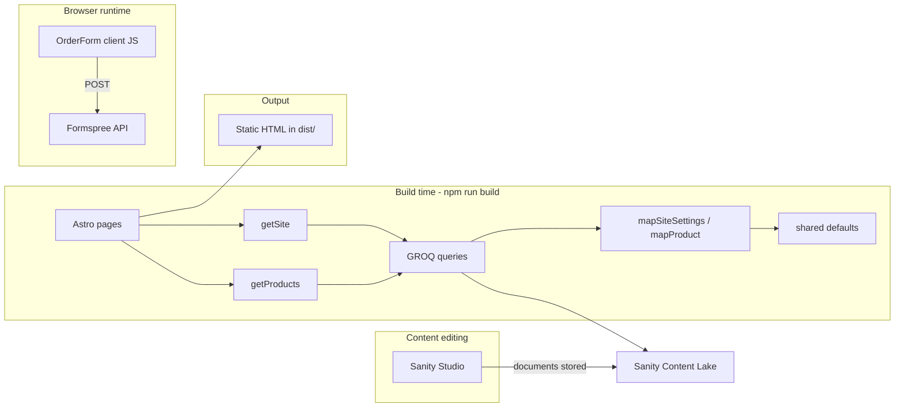

# Architecture Overview

This page shows how all parts of the Love, Ky Cakes website fit together. For Astro fundamentals, read [What is Astro?](02-what-is-astro.md). For the CMS pipeline, read [Sanity to HTML](03-sanity-to-html.md).

---

## System diagram



---

## Repository layout

```
BakeryWebsite/
├── src/                    ← Astro website (public-facing)
│   ├── pages/              ← Routes (/, /order, /about, …)
│   ├── components/         ← Reusable UI pieces
│   ├── layouts/            ← BaseLayout wraps all pages
│   ├── lib/                ← Data loading (getSite, Sanity client)
│   ├── content/            ← TypeScript types + SEO helpers
│   └── styles/             ← Global CSS (Tailwind)
├── shared/                 ← Default content (fallbacks + seed source)
├── sanity/                 ← Sanity Studio (separate app, port 3333)
├── public/                 ← Static assets (images, favicon)
├── astro.config.mjs        ← Astro + Sanity + Tailwind config
├── loadSanityEnv.mjs       ← Loads sanity.env before build
└── sanity.env              ← Sanity project ID and dataset
```

There is **no backend folder**, **no SQL database**, and **no API routes** in the Astro app.

---

## Data flow summary

1. **Editor** changes content in Sanity Studio
2. **Content Lake** stores JSON documents
3. **Build** (`npm run build`) runs Astro pages
4. **getSite() / getProducts()** fetch via GROQ, map to TypeScript objects
5. **Astro templates** embed values into HTML
6. **dist/** is deployed to Netlify
7. **Visitors** receive static HTML; **order form** POSTs to Formspree at runtime

---

## External services

| Service | Purpose | Configured in |
|---------|---------|---------------|
| **Sanity** | Content storage + Studio | `sanity.env`, Studio schemas |
| **Formspree** | Order form email delivery | Sanity Site Settings → Formspree order endpoint |
| **Netlify** | Hosting + builds | [HANDOFF.md](../HANDOFF.md) |
| **Google Fonts** | Dancing Script, Montserrat | `BaseLayout.astro` |
| **Instagram** | Profile embed | `InstagramEmbed.astro` (hardcoded handle) |

No Stripe, no custom server, no SQL database.

---

## Resilience: fallback strategy

Every data loader follows the same pattern:

```
Is Sanity configured?
  Yes → fetch → map → merge with defaults per field
  No  → return shared/defaultSite.ts or defaultProducts.ts
On error → same fallback
```

The site builds and deploys even if Sanity is down. See [Fallback Data](06-data-layer/fallback-data.md).

---

## Two apps, one repo

| App | Start command | Port | Purpose |
|-----|---------------|------|---------|
| Astro site | `npm run dev` | 4321 | Public website |
| Sanity Studio | `npm run sanity:dev` | 3333 | Content editing |

They share `shared/` for default content and `sanity.env` for project configuration. They do not share a runtime — Studio talks to Sanity cloud; Astro fetches from Sanity cloud at build time.

---

## Authentication

| Surface | Auth |
|---------|------|
| Public website | None — all pages are public |
| Sanity Studio | Sanity login (Google/email) |
| Formspree dashboard | Formspree account login |
| Netlify | Netlify account login |

---

## See also

- [Getting started](01-getting-started.md)
- [Config and environment](05-config-and-env.md)
- [Order flow](11-order-flow.md)
- [Build and deploy](12-build-and-deploy.md)
- [HANDOFF.md](../HANDOFF.md) — operations and account ownership
