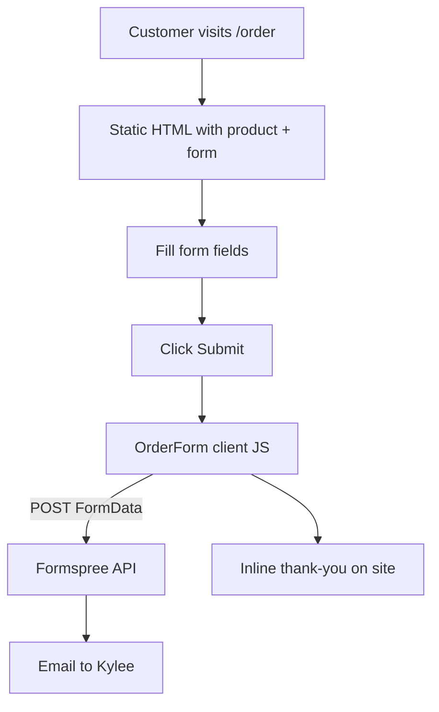

# Order Flow

End-to-end path from customer intent to Kylee's inbox.

---

## Overview

This is **not e-commerce**. There is no cart, payment, or inventory system. Customers submit a **request**; Kylee confirms by phone/email.

---

## Build time (before customer visits)

| Step | What happens |
|------|--------------|
| 1 | `order.astro` calls `getSite()` + `getProducts()` |
| 2 | Sanity provides products, intro, disclaimer, Formspree URL |
| 3 | `OrderForm.astro` compiled into HTML with product names, prices, form `action` URL |
| 4 | Deployed to Netlify as static files |

Customer receives pre-built page — no Sanity call in browser for content.

---

## Runtime (customer submits)

1. Customer selects product (if multiple), fills name/email/phone/date, checks disclaimer
2. Client JS intercepts submit (`preventDefault`)
3. `fetch(formAction, { method: 'POST', body: FormData, headers: { Accept: 'application/json' } })`
4. Formspree validates and sends email
5. On success: form hidden, thank-you panel shown (stays on lovekycakes.com)
6. On failure: error alert, button re-enabled

---

## Form fields sent to Formspree

| Field name | Content |
|------------|---------|
| `name` | Customer name |
| `email` | Customer email |
| `phone` | Phone |
| `delivery-date` | Preferred date |
| `quantity` | Number of cakes |
| `product` | Selected cake name (hidden field) |
| `instructions` | Special requests |
| `disclaimer-ack` | Checkbox (on) |

---

## CMS configuration

**Site Settings → Formspree order endpoint**

URL format: `https://formspree.io/f/xxxxx`

- Stored in Sanity → mapped to `site.formEndpoints.order`
- Baked into form `action` at build time
- If empty: submit disabled, notice shown

After changing URL in Sanity, **redeploy** the site so new `action` appears in HTML.

---

## See also

- [OrderForm component](08-components/order-form.md)
- [Order page](07-pages/order.md)
- [HANDOFF.md](../HANDOFF.md) — Formspree account transfer
